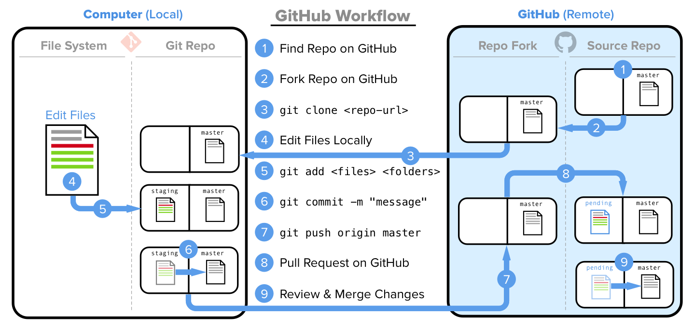

## Init, Clone, Add, Commit, Push & Pull

**Let's make a movie!**

### Step 1: Create

As **Screenwriter** you have big ideas, and want to cast the best A-list actors to play the roles in your story.

You have to make the movie. You need to list the character in your screen play.
(List 5 character who will appear in your screenplay)

For example:
The Howling Moon
- The Heiress: Scarlet Johansson
- Col. Mustard: George Clooney
- The Step Daughter: Lady Gaga
- The Handyman: Brad Pitt
- The Butler: Danny DeVito

### Step 2: Publish

You got big plans you want to make the most awesome movie since The Room.
You are determined to make this big, to go big you need big names!

You need to publish your work before you can help. Upload your work to GitHub.

## Git Workflow

## Fork, Pull Request & Merge Changes

### Step 3: Fork & Edit

A Director collaborates by editing the cast to preferred actors famous people.

As **Director** you have to keep an eye on
the budget. You'll probably have to cast Make School students and staff as these are the
only people you can convince to play the roles for the money you have available.

You and a partner(s) are going to help another team of screenwriters improve their movie based on the budget. Find their repository on GitHub and *fork* it. Once that's done, each of you *clone* **the forked repo** on your computer (not the other team's source repo). Now each of you edit their movie synopsis, characters list, and casting assignments. Add and commit your changes, and then push your work to your fork on GitHub.

### Step 4: Pull Request

Now that you've edited *your fork* of the movie repo, you need to *open a pull request* to share your improvements and have them merge into the original team's source repo.

### Step 5: Review Changes

By now, another team should have already opened a few pull requests on your team's movie repo to improve your movie. Review the proposed changes and accept them into your source repository. You may run into *merge conflicts* while doing this. Work with your partner to resolve any conflicts to accept the changes and close the pull requests. Finally, you should *pull* those changes to your computer's local clone of your repo.

## GitHub Workflow

