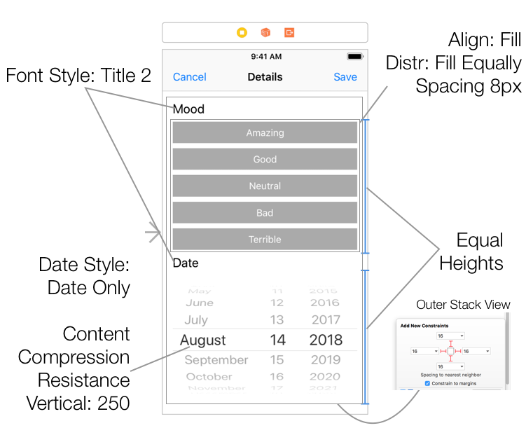

#### Layout the DetailedEntryViewController
1. Add mood buttons in a `VerticalStackView`: *Amazing*, *Good*, *Neutral*, *Bad*, *Terrible*
	1. Alignment: *Fill* Distribution: *Fill Equally*
	2. Spacing: *8px*
	3. Button Font Color: *White*
	4. Button Background Color: *Light Gray Color*
2. Add a `UIDatePicker`
	1. Show *Date only*
	2. *vertical content compression resistance priority* for the *data picker* from *750* to *250*
3. Stack the date picker with the vertical stack view of buttons with another `VerticalStackView`
	1. Alignment: *Fill* Distribution: *Fill*
	2. Spacing: *8px*
4. Add Two title labels to each section of the outer stack view
	1. One above the buttons stack view titled: *Mood*
	2. Another above the date picker titled: *Date*
	3. Each label set its font to *Title 2*
5. Pin the outer stack view to the *margins* of the root *view* with *16 for each constraint*
6. Add an *Equal Heights* constraint to the *vertical stack view of buttons* and the *date picker*
7. From the *Object Pallet* add a *Navigation Item* over the `DetailedEntryViewController`. Then,
8. Add two bar button items: one for *Cancel* and the other for *Save*
9. And update the title of the navigation item to *Details*
The Final Outcome looks like this:

#### Connect the Storyboard with the DetailedEntryViewController
1. In the `MoodDetailedViewController` add the following `IBOutlet`s  and connect each outlet with the storyboard:
```swift
class MoodDetailedViewController: UIViewController {
	  ...
    @IBAction func pressSave(_ sender: UIBarButtonItem) {

    }

    @IBAction func pressCancel(_ sender: UIBarButtonItem) {

    }

    @IBOutlet weak var buttonAmazingMood: UIButton!
    @IBOutlet weak var buttonGoodMood: UIButton!
    @IBOutlet weak var buttonNeutralMood: UIButton!
    @IBOutlet weak var buttonBadMood: UIButton!
    @IBOutlet weak var buttonTerribleMood: UIButton!
    @IBAction func pressMood(_ button: UIButton) {

    }

    @IBOutlet weak var datePicker: UIDatePicker!
    @IBAction func datePickerDidChangeValue(_ sender: UIDatePicker) {

    }
	  ...
}
```
2. Add `func updateUI()` to handle loading the view with the proper values from the date and mood properties. *Also* update the `viewDidLoad()`
```swift
class MoodDetailedViewController: UIViewController {
    ...
    private func updateUI() {
        updateMood(to: mood)
        datePicker.date = date
    }
    ...
    override func viewDidLoad() {
        super.viewDidLoad()

        updateUI()
    }
}
```
3. Add `private func updateMood(to newMood: MoodEntry.Mood) { ... }` to update the buttons and the mood property
```swift
class MoodDetailedViewController: UIViewController {
    ...
    private func updateMood(to newMood: MoodEntry.Mood) {
        let unselectedColor = #colorLiteral(red: 0.8039215803, green: 0.8039215803, blue: 0.8039215803, alpha: 1)
        switch newMood {
        case .none:
            buttonAmazingMood.backgroundColor = unselectedColor
            buttonGoodMood.backgroundColor = unselectedColor
            buttonNeutralMood.backgroundColor = unselectedColor
            buttonBadMood.backgroundColor = unselectedColor
            buttonTerribleMood.backgroundColor = unselectedColor
        case .amazing:
            buttonAmazingMood.backgroundColor = newMood.colorValue
            buttonGoodMood.backgroundColor = unselectedColor
            buttonNeutralMood.backgroundColor = unselectedColor
            buttonBadMood.backgroundColor = unselectedColor
            buttonTerribleMood.backgroundColor = unselectedColor
        case .good:
            buttonAmazingMood.backgroundColor = unselectedColor
            buttonGoodMood.backgroundColor = newMood.colorValue
            buttonNeutralMood.backgroundColor = unselectedColor
            buttonBadMood.backgroundColor = unselectedColor
            buttonTerribleMood.backgroundColor = unselectedColor
        case .neutral:
            buttonAmazingMood.backgroundColor = unselectedColor
            buttonGoodMood.backgroundColor = unselectedColor
            buttonNeutralMood.backgroundColor = newMood.colorValue
            buttonBadMood.backgroundColor = unselectedColor
            buttonTerribleMood.backgroundColor = unselectedColor
        case .bad:
            buttonAmazingMood.backgroundColor = unselectedColor
            buttonGoodMood.backgroundColor = unselectedColor
            buttonNeutralMood.backgroundColor = unselectedColor
            buttonBadMood.backgroundColor = newMood.colorValue
            buttonTerribleMood.backgroundColor = unselectedColor
        case .terrible:
            buttonAmazingMood.backgroundColor = unselectedColor
            buttonGoodMood.backgroundColor = unselectedColor
            buttonNeutralMood.backgroundColor = unselectedColor
            buttonBadMood.backgroundColor = unselectedColor
            buttonTerribleMood.backgroundColor = newMood.colorValue
        }

        mood = newMood
    }
    ...
}
```
#### Update properties from the UI
1. Add the following to `func pressMood(button:)`:
```swift
class MoodDetailedViewController: UIViewController {
    ...
    @IBAction func pressMood(_ button: UIButton) {
        switch button.tag {
        case 0:
            updateMood(to: .amazing)
        case 1:
            updateMood(to: .good)
        case 2:
            updateMood(to: .neutral)
        case 3:
            updateMood(to: .bad)
        case 4:
            updateMood(to: .terrible)
        default:

            //NOTE: error handling
            print("unhandled button tag")
        }
    }
	  ...
}
```
2. In the storyboard, update each mood button with tags from 0 to 4. This is how we’ll know which mood button was pressed
3. Add the following for `func datePickerChanged(sender:)`:
```swift
class MoodDetailedViewController: UIViewController {
    ...
    @IBAction func datePickerDidChangeValue(_ sender: UIDatePicker) {
        date = datePicker.date
    }
	  ...
}
```
::testable-state: display selected entry in the detailed view controller. Select mood buttons and watch the colors update. *Cancel and save buttons do not work, yet*::
